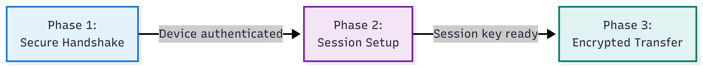
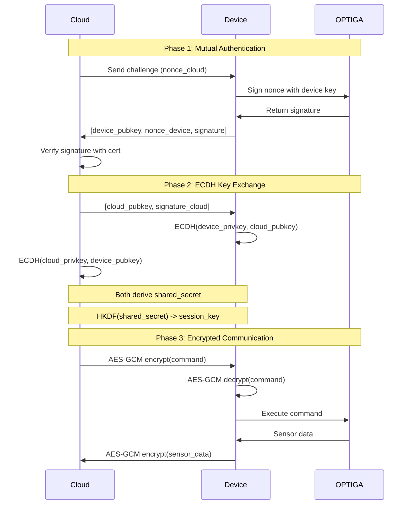

# Part 3: Encrypted Communication Channel

**Protect data in transit - End-to-end encrypted channel with AES-GCM and mutual authentication**

> **Part 3 of 3** | [Part 2: Signing <-](https://github.com/nitikorn20/psoc-edge-optiga-02-signing) | [<- Back to Tutorial Hub](https://github.com/nitikorn20/optiga-tfm-connectivity-tutorials)

---

## What You'll Build

A complete secure communication demo that:
- ✅ Establishes authenticated handshake with ECDSA signatures
- ✅ Derives session keys via ECDH + HKDF
- ✅ Encrypts data with AES-GCM (Authenticated Encryption)
- ✅ Protects data integrity with cryptographic tags

**Why secure channels matter:** Unencrypted IoT communication exposes sensor data, commands, and device credentials to eavesdropping and tampering. See [Why Hardware Security Matters](https://github.com/nitikorn20/optiga-tfm-connectivity-tutorials#why-hardware-security-matters) in the Tutorial Hub.

**Time:** ~90 minutes | **Level:** Advanced

---

## How It Works

This demo shows a complete **3-phase secure communication protocol**:

<div align="center">


</div>

### Phase 1: Secure Handshake
- Device generates ECDSA key pair (simulates OPTIGA device key)
- Device signs challenge nonce to prove identity
- Signature verification (simulated cloud verification on-device)
- ECDH key exchange with a simulated cloud peer to derive shared secret

### Phase 2: Session Setup
- Derive AES-GCM session key via HKDF from the ECDH shared secret
- Establish authenticated encryption parameters

### Phase 3: Encrypted Data Transfer
- Encrypt sensor data: `"SENSOR_DATA:TEMP=25.5"`
- Transmit ciphertext + authentication tag
- Decrypt and verify data integrity

**Output format:** Uses `[HS]` (handshake) and `[DATA]` tags for easy message flow tracking. Cloud side is simulated on-device to keep the demo self-contained.

---

## Quick Start

### Prerequisites

- **PSoC™ Edge E84 Evaluation Kit**
  - Includes integrated **OPTIGA™ Trust M** chip (pre-configured)
- **USB Type-C cable**
- **ModusToolbox™ 3.6+**

**Jumper Settings:**
- BOOT SW: **OFF**
- J20, J21: **NC** (not connected)

See [Hardware Setup Guide](https://github.com/nitikorn20/optiga-tfm-connectivity-tutorials#prerequisites) in the Tutorial Hub for photos.

### Build and Run

```bash
# Build all projects
make -j8

# Program device
make program
```

### Expected Output

Open serial terminal (115200 baud) and reset the board:

```
=======================================================
  OPTIGA Trust M - Secure Communication Channel
  PSoC Edge E84 | TF-M Secure Platform
=======================================================

========== Phase 1: Secure Handshake ==========

Simulating device authentication and ECDH key exchange...

[HS] dev_pub:
0x04 0x8f 0x3d 0x71 0xa5 0xc2 0x9b 0x47 0xe1 0x92 0x6d 0xf8 0x3a 0xb4 0x5e 0x2c
0x7d 0x18 0xa3 0x64 0xf9 0x2b 0x5c 0x87 0xd4 0x31 0x6e 0xb2 0x59 0x8a 0xc7 0x1f
0x42 0x9d 0xe6 0x73 0xa8 0x24 0x5f 0xb1 0x68 0xd5 0x3c 0x97 0xf2 0x6a 0x1e 0x84
0xc9 0x56 0xb3 0x2f 0x7a 0xd8 0x45 0x91 0xec 0x6b 0x27 0xf4 0x82 0x3e 0xa5 0x19
0xc6

[HS] nonce:
0xd5 0x91 0x3b 0x51 0x48 0x6d 0xba 0x76 0x37 0xeb 0x01 0x43 0xd3 0x0f 0xaf 0x2c

[HS] sig:
0x9c 0x37 0x5f 0x5a 0xe9 0xde 0x46 0x53 0xf6 0xd3 0xc8 0xda 0x10 0xf3 0xec 0xcf
0xb3 0xa0 0xd3 0x7e 0x11 0x16 0xe3 0xed 0x16 0xd4 0x11 0x00 0xcb 0x3b 0xef 0xc7
0x3d 0x1c 0x45 0x27 0xfe 0xbc 0xda 0x4b 0x69 0xcd 0x5e 0x30 0x29 0x59 0xc6 0x3d
0x62 0xc5 0xf9 0x4f 0x28 0x11 0x76 0xf2 0x40 0xa4 0xd3 0x44 0x3e 0x75 0x6d 0xbc

    [OK] Device authenticated

Performing ECDH key exchange...

[HS] ecdh_dev_pub:
0x04 0x13 0xeb 0x6f 0x86 0x7c 0xb5 0xff 0x45 0x2d 0x84 0xec 0x6e 0x8a 0x5c 0x5b
0x46 0xad 0x2b 0xc7 0x5b 0x88 0xb9 0x3f 0x47 0x5f 0x34 0x87 0x9c 0x78 0x97 0xcf
0x5a 0x94 0xcb 0x4d 0xbd 0x76 0xf0 0x4c 0x19 0x9d 0xa1 0x10 0xd2 0x61 0x61 0x22
0x82 0x64 0x5e 0x40 0x6a 0x39 0x0b 0x6e 0xef 0x5e 0xb8 0x20 0x70 0xf1 0xa8 0xaf
0xd6

[HS] ecdh_cloud_pub:
0x04 0x33 0xc4 0x6d 0x0f 0x3f 0xba 0x01 0xc7 0x55 0x90 0x96 0x95 0x84 0x57 0xba
0x73 0xfe 0x4c 0xf2 0xdf 0x26 0xe7 0xfb 0xd1 0x70 0x03 0xa7 0xfa 0x35 0x7e 0xfa
0x4e 0x3d 0x7b 0x58 0x64 0x2b 0x83 0xe8 0xc9 0xe4 0xc1 0xf5 0x33 0xc6 0x6f 0x15
0xbf 0xd0 0x20 0xd7 0xca 0xd4 0xf7 0x50 0xd6 0x3c 0x4a 0x0c 0x92 0x6d 0xe0 0xc6
0x47

    [OK] ECDH shared secret established
    [OK] Handshake complete

========== Phase 2: Session Setup ==========

Deriving AES-GCM session key with HKDF...

    [OK] Session key established
    - Algorithm: AES-128-GCM (AEAD)
    - Authentication tag: 16 bytes

========== Phase 3: Encrypted Data Transfer ==========

[DATA] plaintext: SENSOR_DATA:TEMP=25.5

[DATA] nonce:
0x7a 0x3f 0x91 0x6e 0xc2 0x58 0xb4 0xd7 0x29 0x85 0xa1 0x4f

[DATA] ciphertext+tag:
0x8b 0x4d 0x72 0xa6 0x1f 0x93 0xe5 0x38 0xc9 0x64 0xb7 0x2a 0xf1 0x85 0x3c 0xd9
0x6e 0xa4 0x57 0x1b 0x8f 0xc2 0x35 0x9a 0xd6 0x73 0xe8 0x41 0xb5 0x2f 0x7c 0xa9
0x14 0x68 0xd3 0x5e 0x92

    [OK] Data encrypted (38 bytes)

Decrypting received data...

[DATA] decrypted: SENSOR_DATA:TEMP=25.5
    [OK] Data integrity verified

=======================================================
  Secure channel demo completed successfully!
  - Device authenticated with ECDSA signature
  - Session key established
  - Data encrypted and verified with AES-GCM
=======================================================
```

---

## Understanding Secure Communication

### Why Secure Channels Matter

IoT devices need to:
- **Authenticate identity** - Prove device is genuine (not counterfeit)
- **Protect data** - Encrypt sensor readings and commands
- **Detect tampering** - Verify messages haven't been modified

This demo shows the complete cryptographic flow used in production IoT systems.

---

## This Demo vs Production

| Aspect | This Demo | Production Deployment |
|--------|-----------|----------------------|
| **Communication** | Cloud simulated on-device (self-contained) | **Cloud <-> Device bidirectional** |
| **Key storage** | Ephemeral (volatile RAM) | **OPTIGA persistent device key** |
| **Peer** | Simulated cloud (on-device) | **Actual server/gateway** |
| **Key exchange** | ECDH + HKDF (simulated peer) | **ECDH + HKDF with real peer** |
| **Verification** | On-device (simulated cloud) | **Cloud verifies with registered cert** |
| **Session lifetime** | One-time demo | **Multiple messages per session** |
| **Purpose** | Learn encryption concepts | **Secure IoT data transmission** |

⚠️ **Important Notes:**

**This demo focuses on teaching secure channel concepts** using self-contained key management:
- ✅ Perfect for learning handshake -> encryption -> decryption flow
- ✅ Shows PSA Crypto API usage for AES-GCM and ECDSA
- ✅ Autonomous demo - no external tools required
- ❌ NOT production-ready (ephemeral keys regenerated each boot)
- ❌ Device key exists in MCU RAM (not hardware-protected)
- ✅ Cloud peer simulated on-device (no PC/network)
- ✅ ECDH + HKDF derived session key (ephemeral per boot)

**For production systems:**
- Use **OPTIGA Trust M persistent device keys** for authentication
- Private keys never leave secure hardware
- Perform ECDH with the real cloud/gateway public key
- Derive session keys with HKDF (HMAC-based Key Derivation)
- Session keys exist only for current connection

---

## Production Flow Example

Real IoT device-to-cloud communication:

<!-- Image: images/production-flow-sequence.png -->
<!-- Content: Production sequence diagram showing Cloud <-> Device <-> OPTIGA interaction -->



### Production Code Pattern (Pseudocode)

**Cloud side:**
```python
# Phase 1: Verify device
def authenticate_device(device_pubkey, nonce, signature):
    cert = get_device_certificate(device_pubkey)
    if verify_ecdsa(cert.public_key, nonce, signature):
        return True  # Device is genuine
    return False

# Phase 2: Establish session
cloud_privkey, cloud_pubkey = generate_ecdh_keypair()
shared_secret = ecdh_derive(cloud_privkey, device_pubkey)
session_key = hkdf(shared_secret, "session-key-v1")

# Phase 3: Send encrypted command
nonce = random_bytes(12)
ciphertext = aes_gcm_encrypt(session_key, nonce, "ACTUATE_VALVE")
send_to_device(nonce, ciphertext)
```

**Device side (PSoC Edge + OPTIGA):**
```c
// Phase 1: Authenticate with OPTIGA device key
psa_key_id_t device_key = OPTIGA_DEVICE_KEY_ID;  // OID 0xE0F1
psa_export_public_key(device_key, device_pubkey, ...);
psa_generate_random(nonce_device, 16);
psa_sign_message(device_key, ..., nonce_device, ..., signature, ...);
// Send to cloud: [device_pubkey, nonce_device, signature]

// Phase 2: ECDH + HKDF
psa_key_id_t ecdh_privkey;
psa_generate_key(&ecdh_attributes, &ecdh_privkey);
psa_raw_key_agreement(PSA_ALG_ECDH, ecdh_privkey, cloud_pubkey,
                      shared_secret, ...);

psa_key_attributes_t secret_attr = PSA_KEY_ATTRIBUTES_INIT;
psa_set_key_usage_flags(&secret_attr, PSA_KEY_USAGE_DERIVE);
psa_set_key_type(&secret_attr, PSA_KEY_TYPE_DERIVE);
psa_set_key_bits(&secret_attr, shared_secret_len * 8);
psa_key_id_t shared_secret_key_id;
psa_import_key(&secret_attr, shared_secret, shared_secret_len,
               &shared_secret_key_id);

psa_key_attributes_t session_key_attributes = PSA_KEY_ATTRIBUTES_INIT;
psa_set_key_usage_flags(&session_key_attributes,
                        PSA_KEY_USAGE_ENCRYPT | PSA_KEY_USAGE_DECRYPT);
psa_set_key_algorithm(&session_key_attributes, PSA_ALG_GCM);
psa_set_key_type(&session_key_attributes, PSA_KEY_TYPE_AES);
psa_set_key_bits(&session_key_attributes, 128);

psa_key_derivation_operation_t kdf = PSA_KEY_DERIVATION_OPERATION_INIT;
psa_key_derivation_setup(&kdf, PSA_ALG_HKDF(PSA_ALG_SHA_256));
psa_key_derivation_input_key(&kdf, PSA_KEY_DERIVATION_INPUT_SECRET,
                             shared_secret_key_id);
psa_key_derivation_output_key(&session_key_attributes, &kdf, &session_key_id);

// Phase 3: Receive encrypted command
psa_aead_decrypt(session_key, PSA_ALG_GCM,
                 nonce, 12, NULL, 0,
                 ciphertext, ciphertext_len,
                 plaintext, sizeof(plaintext), &plaintext_len);
// plaintext = "ACTUATE_VALVE"
```

**Security Properties:**
- **Mutual authentication** - Both sides prove identity
- **Perfect forward secrecy** - Session keys unique per connection
- **Replay protection** - Nonces prevent message replay
- **Tamper detection** - GCM tag ensures integrity

---

## Key Concepts

### AES-GCM (Galois/Counter Mode)

**AEAD = Authenticated Encryption with Associated Data**

```
Input:
  - Key (128-bit)
  - Nonce/IV (96-bit, must be unique per message)
  - Plaintext
  - Additional authenticated data (optional)

Output:
  - Ciphertext (same length as plaintext)
  - Authentication tag (128-bit)
```

**Why AES-GCM?**
- ✅ **Encryption + Authentication** in one operation
- ✅ **Detect tampering** - Modified ciphertext fails verification
- ✅ **Hardware accelerated** - OPTIGA Trust M support
- ✅ **NIST approved** - Standard for IoT security

**Critical: Nonce must NEVER repeat with same key!**
- This demo uses random nonces (secure for ephemeral keys)
- Production: Use counter-based nonces or ensure randomness

### ECDSA Authentication

**Why device authentication?**
- Cloud must verify device is genuine (not counterfeit)
- Signature proves device owns private key
- Public key verified against registered certificate

**Flow:**
1. Cloud sends challenge (random nonce)
2. Device signs nonce with OPTIGA device key
3. Cloud verifies signature -> accepts/rejects device

---

## Code Walkthrough

### Phase 1: Device Authentication

```c
// Generate device ECDSA key (simulates OPTIGA device key)
psa_key_attributes_t device_key_attributes;
psa_set_key_usage_flags(&device_key_attributes,
    PSA_KEY_USAGE_SIGN_MESSAGE | PSA_KEY_USAGE_VERIFY_MESSAGE);
psa_set_key_algorithm(&device_key_attributes,
    PSA_ALG_ECDSA(PSA_ALG_SHA_256));
psa_set_key_type(&device_key_attributes,
    PSA_KEY_TYPE_ECC_KEY_PAIR(PSA_ECC_FAMILY_SECP_R1));
psa_set_key_bits(&device_key_attributes, 256);

psa_key_id_t device_key_id;
psa_generate_key(&device_key_attributes, &device_key_id);

// Sign challenge nonce
uint8_t nonce[16];
uint8_t signature[64];
size_t signature_len;
psa_generate_random(nonce, sizeof(nonce));
psa_sign_message(device_key_id, PSA_ALG_ECDSA(PSA_ALG_SHA_256),
                 nonce, sizeof(nonce),
                 signature, sizeof(signature), &signature_len);
```

**In production:** Replace `psa_generate_key()` with OPTIGA persistent key:
```c
psa_key_id_t device_key_id = OPTIGA_DEVICE_KEY_ID;  // Pre-provisioned
```

---

### Phase 2: Session Key Setup

```c
// Derive AES-GCM session key from ECDH shared secret using HKDF
psa_key_attributes_t secret_key_attributes;
psa_key_attributes_t session_key_attributes;
psa_key_id_t shared_secret_key_id;
psa_key_id_t session_key_id;

psa_set_key_usage_flags(&secret_key_attributes, PSA_KEY_USAGE_DERIVE);
psa_set_key_algorithm(&secret_key_attributes, PSA_ALG_HKDF(PSA_ALG_SHA_256));
psa_set_key_type(&secret_key_attributes, PSA_KEY_TYPE_DERIVE);
psa_set_key_bits(&secret_key_attributes, shared_secret_len * 8);
psa_import_key(&secret_key_attributes, shared_secret, shared_secret_len,
               &shared_secret_key_id);

psa_key_derivation_operation_t kdf = PSA_KEY_DERIVATION_OPERATION_INIT;
psa_key_derivation_setup(&kdf, PSA_ALG_HKDF(PSA_ALG_SHA_256));
psa_key_derivation_input_bytes(&kdf, PSA_KEY_DERIVATION_INPUT_SALT, nonce, 16);
psa_key_derivation_input_key(&kdf, PSA_KEY_DERIVATION_INPUT_SECRET,
                             shared_secret_key_id);
psa_key_derivation_set_capacity(&kdf, 16);
psa_key_derivation_output_key(&session_key_attributes, &kdf, &session_key_id);
```

**In production:** Use a real cloud/gateway peer for the ECDH exchange and replace simulated keys with OPTIGA persistent keys.

---

### Phase 3: Encrypt/Decrypt Data

```c
// Encrypt sensor data
const unsigned char plaintext[] = "SENSOR_DATA:TEMP=25.5";
uint8_t ciphertext[64];
uint8_t nonce[12];
size_t ciphertext_len;

psa_generate_random(nonce, sizeof(nonce));
psa_aead_encrypt(session_key_id, PSA_ALG_GCM,
                 nonce, sizeof(nonce),
                 NULL, 0,  // No additional authenticated data
                 plaintext, sizeof(plaintext),
                 ciphertext, sizeof(ciphertext), &ciphertext_len);

// Decrypt received data
uint8_t decrypted[64];
size_t decrypted_len;
psa_aead_decrypt(session_key_id, PSA_ALG_GCM,
                 nonce, sizeof(nonce),
                 NULL, 0,
                 ciphertext, ciphertext_len,
                 decrypted, sizeof(decrypted), &decrypted_len);
```

**Security notes:**
- `ciphertext_len` = `plaintext_len` + 16 (authentication tag)
- GCM automatically verifies tag during decryption
- If tag mismatch -> `PSA_ERROR_INVALID_SIGNATURE` (data tampered)

---

## Project Structure

```
BLOG3/
├── proj_bootloader/    # Edge Protect Bootloader
├── proj_cm33_s/        # TF-M (Secure)
├── proj_cm33_ns/       # Main application
│   └── main.c          # Secure channel demo
├── proj_cm55/          # CM55 core
├── templates/          # Config templates
└── README.md           # This file
```

**Main implementation:** [proj_cm33_ns/main.c](proj_cm33_ns/main.c)

---

## Troubleshooting

<details>
<summary><strong>Device doesn't boot</strong></summary>

**Check:**
- BOOT SW in OFF position
- J20, J21 not connected
- USB cable to KitProg3 port

**Try:**
```bash
make clean_all
make -j8
make program
```

</details>

<details>
<summary><strong>Encryption fails</strong></summary>

**Possible causes:**
- TF-M initialization failed
- PSA Crypto not initialized
- Invalid key attributes

**Solution:**
- Check TF-M boots correctly
- Verify `psa_crypto_init()` succeeded
- Check serial logs for PSA error codes

</details>

<details>
<summary><strong>Decryption fails with "invalid signature"</strong></summary>

**This is expected if:**
- Ciphertext was modified (tampering detected)
- Wrong nonce used for decryption
- Wrong session key

**In this demo:** Should never happen (self-contained)

</details>

---

## Security Best Practices

### For Production Deployment

1. **Use Hardware-Backed Keys**
   ```c
   // ❌ INSECURE: Ephemeral key in RAM
   psa_set_key_lifetime(&attrs, PSA_KEY_LIFETIME_VOLATILE);

   // ✅ SECURE: OPTIGA persistent key
   psa_key_id_t device_key = OPTIGA_DEVICE_KEY_ID;
   ```

2. **Never Reuse Nonces**
   ```c
   // ❌ INSECURE: Static nonce
   uint8_t nonce[12] = {0};  // DON'T!

   // ✅ SECURE: Random or counter-based
   psa_generate_random(nonce, 12);
   ```

3. **Verify Authentication Tags**
   ```c
   // AES-GCM automatically verifies tag during decrypt
   status = psa_aead_decrypt(...);
   if (status != PSA_SUCCESS) {
       // Data tampered - REJECT message
       return ERROR_TAMPERED;
   }
   ```

4. **Use Certificate-Based Device Auth**
   - Register device certificate with cloud during provisioning
   - Cloud verifies signature against registered cert
   - Detect cloned/counterfeit devices

5. **Implement Session Expiry**
   - Rotate session keys periodically
   - Re-authenticate after timeout
   - Limit messages per session key

---

## Next Steps

**✅ Series Completed!** You've mastered hardware-secured IoT communication.

**What you've learned:**
- ✅ **Part 1:** Hardware-rooted device identity and attestation
- ✅ **Part 2:** ECDSA digital signatures with hardware keys
- ✅ **Part 3:** End-to-end encrypted communication channels

**Ready for production?**

This tutorial used **ephemeral keys** (for learning). For production deployments:

1. **Use OPTIGA persistent device keys** - Replace `psa_generate_key()` with OPTIGA key IDs
2. **Replace simulated cloud with real cloud/gateway** - ECDH exchange over the network
3. **Add certificate-based authentication** - Cloud verifies device certificates
4. **Build cloud verification service** - Validate attestations and signatures
5. **Implement session management** - Key rotation, timeout, replay protection

**Production reference:** [Infineon TF-M Crypto Examples](https://github.com/Infineon/mtb-example-psoc-edge-epc2-tfm-crypto)

---

## Additional Resources

### Documentation
- [Tutorial Series Hub](https://github.com/nitikorn20/optiga-tfm-connectivity-tutorials)
- [Why Hardware Security Matters](https://github.com/nitikorn20/optiga-tfm-connectivity-tutorials/blob/main/docs/why-optiga-trust-m.md)
- [PSA Crypto API Reference](https://arm-software.github.io/psa-api/crypto/)
- [OPTIGA Trust M Overview](https://www.infineon.com/optiga-trust-m)
- [TF-M Documentation](https://tf-m-user-guide.trustedfirmware.org/)
- [NIST AES-GCM Specification](https://nvlpubs.nist.gov/nistpubs/Legacy/SP/nistspecialpublication800-38d.pdf)

### Previous Parts
- [Part 1: Device Attestation](https://github.com/nitikorn20/psoc-edge-optiga-01-attestation)
- [Part 2: Digital Signatures](https://github.com/nitikorn20/psoc-edge-optiga-02-signing)

---

## Requirements

- ModusToolbox™ 3.6+
- KIT_PSE84_EVAL_EPC2
- Serial terminal (115200 baud)

## License

Apache License 2.0

**Copyright:**
- (c) 2024-2025, TESA Technology Co., Ltd.
- (c) 2024-2025, Infineon Technologies AG

---

## Contributing

Found issues or have suggestions?
- [Report Issues](https://github.com/nitikorn20/optiga-tfm-connectivity-tutorials/issues)
- [Tutorial Series](../optiga-tfm-connectivity-tutorials/)

---

<div align="center">

**🔐 End-to-end secure IoT communication with hardware root of trust**

[Part 2: Signing <-](https://github.com/nitikorn20/psoc-edge-optiga-02-signing) | [Tutorial Hub ->](https://github.com/nitikorn20/optiga-tfm-connectivity-tutorials)

</div>
